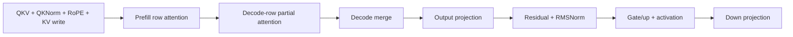
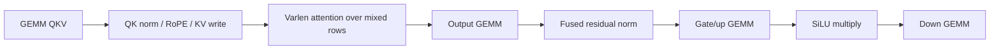
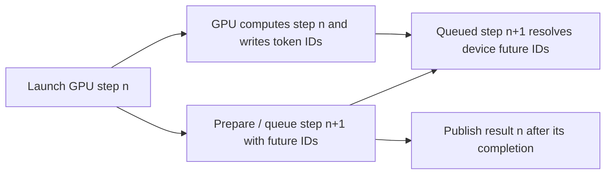

# Matched serving benchmark and execution-graph comparison

The output/down substitution identified a real partial cost, not the entire
remaining gap. This follow-up compares fresh serving runs, preserved matched
Nsight timelines, and the actual reference-container source. No production
kernel, compiler pass, runtime, or deployment is changed in this investigation.

## Fresh unprofiled benchmark

Qwen3-0.6B BF16 on Spark .179 / GB10 sm121, 48 SMs. Input vector is
`[8192,8192,8192,8192,8192,8192,8192,8192]`, output vector is eight 64-token
responses. Prefix/radix reuse is disabled. All engines use the same frozen
model and client workload, but not identical chunking algorithms.

Order: LunaFlux → vLLM → SGLang → SGLang → vLLM → LunaFlux. Each independent
start runs one excluded warmup and three measured waves: six measured waves
and 48 requests per engine. Graph initialization is outside measurement.

| Engine | Median wave ms | Output tok/s | Median request TTFT ms | Median request mean TPOT ms |
| --- | ---: | ---: | ---: | ---: |
| LunaFlux | 4919.0 | 104.09 | 1504.5 | 50.24 |
| vLLM | 4494.0 | 113.93 | 1370.0 | 45.87 |
| SGLang | 4545.5 | 112.64 | 1208.0 | 53.29 |

LunaFlux completion time is **9.46% above vLLM and 8.22% above SGLang**.
TTFT/TPOT summarize per-request vectors; they are not additive components of
wave wall time. SGLang's different admission/chunking policy changes the TTFT
versus TPOT tradeoff. Token counts are checked, not model-quality equivalence.

Fresh-start medians: LunaFlux 4885/4940 ms; vLLM 4497/4494 ms; SGLang
4545/4552 ms. Individual wave ranges: 4885–4943, 4487–4505, 4538–4636 ms.
This is a small, order-reversed repeated experiment, not a broad confidence
interval or a result for all contexts/models.

Serving/container limits were 64 GiB with no swap, controller 8 GiB, and a
32 GiB MemAvailable floor sampled every 500 ms. Minimum available memory was
99.43/66.04/65.82 GiB respectively. All six starts completed and stopped;
the GPU was idle afterward. No concurrent GPU benchmarks ran.

## Where the time actually goes

The following is **one preserved profiled wave**, not the fresh unprofiled
throughput above. It uses the same AOT bundle/route table. CPU logical-work
markers establish all 96 equal-work LunaFlux/vLLM steps. SGLang executes 72
steps with a different chunking policy, so its individual steps are not matched.

GPU busy time is the **union** of kernel/copy/memset intervals, clipped to the
client's epoch bounds. It is not the sum of kernel durations. No GPU activity
does not automatically mean scheduler overhead; it also includes request
arrival, publication, transport, and endpoint tails.

| Profiled wave | LunaFlux ms | vLLM ms | SGLang ms |
| --- | ---: | ---: | ---: |
| Client wall time | 4920.50 | 4496.00 | 4570.32 |
| GPU-active interval union | 4786.51 | 4395.29 | 4537.25 |
| No GPU activity in client interval | 133.99 | 100.71 | 33.07 |
| Sum of kernel durations | 4787.81 | 4395.49 | 4564.55 |
| Kernel overlap, sum minus union | 1.65 | 1.03 | 27.80 |
| Between-step GPU-envelope gaps | 111.43 | 29.30 | 0.017 |
| Kernel invocations | 21,440 | 35,534 | 29,482 |
| Graph launches | 96 | 63 | 64 |

The 424.50 ms LunaFlux/vLLM wall difference decomposes into **391.22 ms more
GPU-active time (92.2%) and 33.28 ms more no-GPU time (7.8%)**. LunaFlux's
larger inter-step gap is partly offset by vLLM's larger *within-step* gaps:
1.19 versus 48.80 ms. Therefore subtracting only inter-step gaps overstates
the net host/launch contribution.

LunaFlux is already fully graph-launched and launches fewer kernels. vLLM
uses direct launches for the 33 prefill/mixed forwards, yet remains faster.
Thus "missing CUDA Graph", "too many launches", or a generic CPU bubble
cannot explain most of this case. Waiting *inside* a GPU kernel is included
in GPU-active time; busy does not mean efficient hardware utilization.

The analyzer retains four small SGLang kernels before its first forward
marker as unassigned. They remain in whole-wave activity totals, not silently
assigned to the first attention layer. Forward-marker overlap is not proof
that all scheduler code overlaps or that GPU dependencies have disappeared.

## Mixed work is the primary optimization workload

From the [exact-work attribution](BENCHMARK_EXACT_MIXED_WORK_2026-10-07.md):

| Logical phase | Extra LunaFlux kernel activity vs vLLM, ms |
| --- | ---: |
| Initial pure prefill: 4 steps | 7.78 |
| Mixed prefill/decode: 29 steps | **279.17** |
| Single-query: 63 steps, including shrinking batches | 105.37 |
| Total | 392.32 |

Mixed steps explain about **66% of the profiled wall gap**. Within the total
GPU-activity difference, attention contributes 196.05 ms and other operations
196.27 ms. These are nested classifications, not extra times to add together.

Two exact-work counterexamples show why an isolated C8 decode or one uniform
prefill probe is not enough (all 28 layers, complete attention chain):

| Query/history rows | Luna attention ms | vLLM attention ms | Difference |
| --- | ---: | ---: | ---: |
| `2047:0, 1:8192` | 13.42 | 13.76 | **Luna faster 0.34 ms** |
| `2043:6093, 1:8194, 1:8198, 1:8202, 1:8206, 1:8211` | 69.35 | 61.29 | **Luna slower 8.06 ms** |

The second step is 13.35 ms slower overall: 8.06 ms attention and 5.29 ms
other kernels. Its attention consists of 48.08 ms prefill, 21.12 ms split
decode partials, and 0.16 ms merge. It is not a merge-launch overhead problem.
The trace alone does not establish whether scheduling these operations
together will beat the current sum; resource contention and numerical laws
must be checked by a controlled replacement.

## Execution paths: what is actually different

### LunaFlux: split mixed-row domains, ordered graph

`engine/device_step/attention_phase_executor.mbt:61–116` appends the prefill
writer, decode partial, and merge in sequence. `internal/cuda/ordered_graph.c:15`
captures all launches on one stream. The local versions of these files and
`ordered_executor.c` match the frozen serving source byte-for-byte.

The P→D edge is execution ordering, not a semantic need for decode to read
prefill outputs. Both write disjoint attention rows. They do share resources
and the following output projection waits for the complete result. Removing
an unnecessary ordering edge is not proof that concurrent kernels will run
faster on the same GPU.

Per-step host behavior observed: submit graph → wait completion → read output
when required → prepare/upload next step → submit next graph. There are 96
`cuEventSynchronize` calls. Their 4787 ms API duration mostly overlaps GPU work;
it must **not** be added to GPU time as 4787 ms of host overhead.

### vLLM: one varlen attention domain, efficient separate projection chains

The pinned container's `vllm-flash-attn.py:687` passes query-prefix offsets,
per-request key lengths, block table and output to a single
`flash_attn_varlen_func` invocation. Mixed rows do not become our serial
prefill kernel plus decode-companion chain. The observed kernel is FA2
`flash_fwd_splitkv_kernel`, with Q64/KV128 traits, not an inferred FA3 path.
The same source also contains FA3 scheduling options; their presence is not
evidence they executed here.

`vllm-qwen3.py:139` keeps the projection independent of the epilogue.
The actual output/down symbols are SM121 `nvjet` GEMMs, while QKV/gate-up use
CUTLASS schedules. This is a complete-chain comparison, including their
extra normalization, RoPE, KV-write and activation kernels.

The pinned `vllm-core.py:336` normal step awaits model execution and updates
the scheduler before its next step. A queued alternative exists at line 374;
the trace has **0/96 next-forward markers before previous GPU completion**.
We cannot attribute this vLLM advantage to SGLang-style forward overlap.

### SGLang: explicit future tokens and CPU/GPU overlap

The pinned `sglang-scheduler.py:1099` runs the current batch before processing
the previous result. At line 2206 it allocates future indices; the forward
stream resolves them from a device future map and stores new results there.
At line 2230 the scheduler can carry negative future indices instead of
waiting for host token IDs. Result publication is separately event-tracked.

This behavior is visible: **71/72 forward markers precede the previous
step's GPU end**, versus 0/96 for LunaFlux and this vLLM run. This is overlap
of preparation/publication with device execution, not simultaneous execution
of dependent transformer layers.

`sglang-flashinfer.py:1055` plans page indices/splits outside the layer loop
and uses graph input buffers plus nonblocking planning. Its prefill path
can choose ragged current-KV and paged-history work with LSE combination;
one global "all fusion" rule is not the reference design. Current sibling
repositories contain related mechanisms, but conclusions about executed
paths above use the actual container files, not sibling HEAD alone.

## Consequence for the next change

1. **Make mixed-row attention a first-class physical work-domain comparison.**
   Compare the present separate chains with a unified ragged task schedule,
   and separately a legal fork/join of disjoint row writers. Carry row/history
   ranges, task ownership, numerical law and scratch/effect dependencies through
   the existing pure IR. Do not add model-name branches or simply another IR
   layer. The late-history losing case and early winning case above must both
   be in the test set, along with all 29 observed mixed vectors.
2. **Retain the proven output/down improvement as a separate track.** Their
   equal-work deficit is 137.79 ms; merely matching reference timing would
   reduce this profiled wave by about 2.8%, not 10%. The previous diagnostic's
   2.01% serving improvement is therefore plausible, not evidence that these
   kernels were irrelevant. It remains diagnostic until numerical/token
   repeatability issues are resolved.
3. **Treat future-token scheduling as bounded complementary work.** Introduce
   an explicit token-future dependency and completion/publication effects,
   preserving cancellation and KV ownership. SGLang provides a concrete design.
   But this trace's entire no-GPU interval is only 134 ms (2.72% of wall),
   and the net difference to vLLM is 33 ms. Eliminating a host bubble cannot
   by itself close the current GPU-dominated gap.

The decisive next experiment is an **attention-chain substitution inside
the frozen complete serving graph**, analogous to the projection experiment:
same activations/KV/numeric contract and work vectors, correctness shadow,
full-chain GPU timing, selected-dispatch proof, then alternating unprofiled
serving. If it produces no serving benefit, reject it rather than promote a
lower instruction count or a theoretical overlap diagram. Current evidence
supports where to test, not a guaranteed speedup from the proposed schedule.

No new hardware-counter capture was taken this turn. The new measurement is
the six-start unprofiled comparison; timeline accounting is a fresh analysis
of preserved matched Nsight captures. It does not newly prove an
instruction-level explanation of every GPU-active millisecond.

## Provenance and reproducibility

- Remote benchmark: `/home/wlc004s/lunaflux-execution-graph-20261007.I8OfKRSw`.
- Local verified download: `/tmp/lunaflux-execution-graph-verified-20261007.V7iqKWvJ`.
- Downloaded raw measurement archive SHA-256:
  `d30ecdad10e6a6ffe9d17b8c8aa82ab1a046a61e98a2939bb161840f8e3b2445`.
- Separate `analysis.tar.gz` contains the comparison, interval accounting and
  six source files copied from the pinned stopped reference containers:
  `bbd8611302826a1e3af504c21bdf25325e34f25d80bfe0bcd09dacb5703f5868`.
- Preserved trace root: `/home/wlc004s/lunaflux-mixed-work-20261007.NnA6SsKN`.
- GPU UUID `GPU-5b603331-c778-d6ef-7ffa-7c6b774fe4a6`, PCI `0000000F:01:00.0`.
- Model SHA-256: `f47f71177f32bcd101b7573ec9171e6a57f4f4d31148d38e382306f42996874b`.
- Runtime `619140a64d70d77d9f6494de4e1e8103b6e1565750fc2015cbf687c0e534f8e8`;
  worker `7da40e6f9f8c07f4152baa1796871651057ff4c9579b9c97fe1ebfa2d3f1ac70`.
- Serving and profiled AOT bundle both:
  `f7afc9b5a0a0a6fa148ca027c26c3c4c9f14b6580550d743c443d3ade94fb58a`;
  execution JSON files also match. The benchmark is of this frozen runtime,
  **not a deployment of the unrelated dirty working tree**.
- vLLM image: `sha256:73e1b0f3230a9377a3109d20be7f8607963a41a715eb3000bc647f5f73c198ff`,
  version `0.13.0+faa43dbf.nv26.01`.
- SGLang image: `sha256:3a9d399434923689565e1a72f5c3fc409323ce039b65bdbe5c2d6ed14abad3a9`.
- Inspected sibling source HEADs: vLLM `10f9b5d74fb4110adfc310278e029af4faea0565`,
  SGLang `a2e88279c28c16945c7c7eacb27f1e066b670a41`; not asserted equal to images.

Scripts: `benchmark_execution_graph_20261007.mbtx`,
`analyze_execution_graph_20261007.mbtx`,
`report_execution_graph_bench_20261007.mbtx` in `benchmarks/gpu_pipeline`.
The analyzer tests interval union against nested/overlapping intervals;
the report checks every request's input/output count. Targeted warning-denied
checks/tests pass. Full-tree/native ABI/sanitizer campaigns are not rerun for
these offline analysis-only additions. AKO's equal-work and interval-accounting
requirements prevent attributing a fast microkernel or sync API time to an
unmeasured whole-engine gain.
